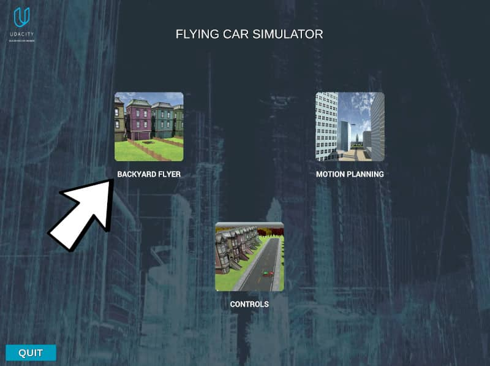

# Backyard Flyer Project
This is a python program that set up a state machine using event-driven code to autonomously flying a drone.

It controls a quadcopter autonomously in the [Udacity's Drone Simulator](https://github.com/udacity/FCND-Simulator-Releases/releases) by sending commands and receiving incoming data from the drone and acting as the flight computer. 

Event-driven code causes the drone to take-off, fly a predetermined path, and land in a simulated backyard environment.

The python code here is similar to how the drone would be controlled from a ground station computer or an onboard flight computer. 
Since communication with the drone is done using MAVLink, this code is also suitable to control an PX4 quadcopter autopilot with very little modification.

This project is a programming assignment of the [Udacity's Flying Car and Autonomous Flight Engineer](https://www.udacity.com/course/flying-car-nanodegree--nd787) Nanodegree.


## Prerequisites

### Step 1: Download the Simulator
If you haven't already, download the version of the simulator that's appropriate for your operating system [from this repository](https://github.com/udacity/FCND-Simulator-Releases/releases).

### Step 2: Set up your Python Environment

If you haven't already, set up your Python environment and get all the relevant packages installed using Anaconda following instructions bellow:

- Download [miniconda](https://conda.io/miniconda.html) and then install by opening the file/app that you download.

- Clone the starter kit
```sh
git clone https://github.com/computationalcore/backyard-flyer
```
- Enter into the starter kit directory
```sh
cd FCND-Term1-Starter-Kit
```
Note: If you have a windows machine, you must rename meta_windows_patch.yml to meta.yml as well.

- Create the miniconda environment (this can take several minutes due to the large number of installs required):
```sh
conda env create -f environment.yml
```
- Activate the Conda Environment (this step is needed ANYTIME you want to work in this environment) 
```sh
source activate fcnd
```

## Installing and Run

After activate the project start environment go the previous folder.
```sh
cd ../
```

### Clone this Repository
```sh
git clone https://github.com/computationalcore/backyard-flyer
```

### Enter project folder
```sh
cd backyard-flyer
```

### Run

Open the simulator and select "BACKYARD FLYER" (indicated in the arrow)



Run the program
```sh
python backyard_flyer.py 
```

The simulated drone should start engine, autonomously fly a 10 meter box at a 3 meter altitude and stop.

## Authors
Vin Busquet
* [https://github.com/computationalcore](https://github.com/computationalcore)

## License

This project is licensed under the MIT License - see the [LICENSE](LICENSE) file for details

## Acknowledgments
* [Flying Car and Autonomous Flight Engineer](https://www.udacity.com/course/flying-car-nanodegree--nd787)
* [Udacity](https://www.udacity.com/)
* [Adrien Perkins](https://github.com/adrnp)
* [Nicholas Roy](https://aeroastro.mit.edu/nicholas-roy)
* [Dominique Luna](https://github.com/domluna)


